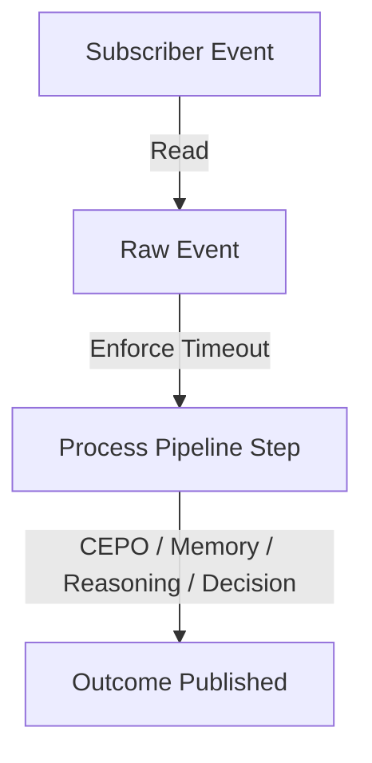

# Bounded Tick Processing Limits

To ensure real-time responsiveness and prevent resource starvation, Chronos enforces bounded execution limits for every pipeline tick.

## Architecture

## Guarantees
1. **Asynchronous Non-Blocking Guards**: Pipeline execution locks (e.g., `orchestrator.write().await`) must be acquired with timeouts or non-blocking try-locks if lock contention is detected.
2. **Deterministic Processing Bounds**: Deep cognitive graph computations (such as entity resolution or transitive path lookups) are bound by depth and resolution bounds to prevent exponential complexity during any individual tick.
3. **Recovery and Lag Handling**: Subscriber lagging notifications (`BusError::ReceiveError`) are handled by logging warning logs and continuing without crashing or freezing the pipeline runtime.
