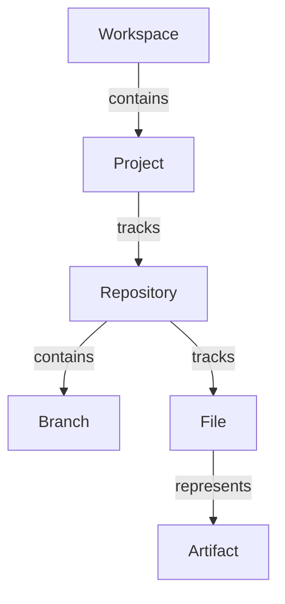

# Semantic Entity Resolution Specification

Semantic Entity Resolution is a Layer 2 (Memory / Knowledge) subsystem. It converts raw, unstructured `ChronosEvent` streams and replays into a structured, semantic `EntityGraph`. 

The system performs deterministic, evidence-based resolution to build a cohesive model of the user's files, repositories, branches, and workspaces.

---

## 1. Specification

### Consumes
*   `ChronosEvent` streams from the `EventBus`.
*   `ChronosEvent` replays from the `EventStore` (for graph reconstruction).

### Produces
*   `KnowledgeEntity` structures stored inside the `EntityGraph`.
*   Side-effect events published to the bus:
    *   `EntityCreated`: Triggered when a new node is resolved.
    *   `EntityUpdated`: Triggered when new evidence alters properties or boosts entity confidence.
    *   `EntityLinked`: Triggered when relationships are discovered between nodes.

---

## 2. Entity Types & Graph Model

### KnowledgeEntity Schema
Every resolved node contains:
*   `id`: UUID string.
*   `entity_type`: `Project`, `Artifact`, `Repository`, `File`, `Branch`, `Workspace`, `Commitment`.
*   `properties`: Key-value map representing the resolved metadata.
*   `provenance`: List of `event_id`s that contributed to this entity's lifecycle.
*   `confidence`: Standardized confidence value (0.0 to 1.0) indicating factual certainty.
*   `version`: Monotonically increasing version counter.

---

## 3. Resolution Rules (Deterministic & AI-Free)

1.  **Repository Resolution (`ResolveGitRepositoryRule`)**:
    *   *Input:* `GitRepositoryDiscovered` or `GitCommitCreated`.
    *   *Logic:* Extracts the `repository_path` and `repository_name`. If a `Repository` node already exists matching the path, it is updated and the event ID is appended to the provenance list. If not, a new `Repository` entity is resolved (Confidence: 1.0).
2.  **File & Artifact Resolution (`ResolveFileRule` / `ResolveArtifactRule`)**:
    *   *Input:* Git logs referencing commit changes containing file modifications.
    *   *Logic:* Extracts the `file_path`. Resolves a `File` entity (Confidence: 1.0). If a file accumulates multiple references across different events, its reference count increments, and it is linked to an `Artifact` node representing the logical entity.
3.  **Branch Resolution (`ResolveBranchRule`)**:
    *   *Input:* `GitBranchSwitched` containing `to_branch`.
    *   *Logic:* Resolves a `Branch` entity and links it to the parent `Repository` via a `has_branch` relationship.

---

## 4. Replay & Persistence Design
The entity graph itself is not directly serialized as a single DB blob. Instead, the graph is a **materialized projection** of the immutable Event Store. 

To reconstruct the graph across restarts:
1.  Initialize an empty `EntityGraph`.
2.  Query `replay` from the `EventStore` starting from epoch `0`.
3.  Feed the events sequentially into the `EntityResolver` to reconstruct the exact node/relationship state.
4.  This guarantees 100% determinism and auditability without relying on heavy database states.
