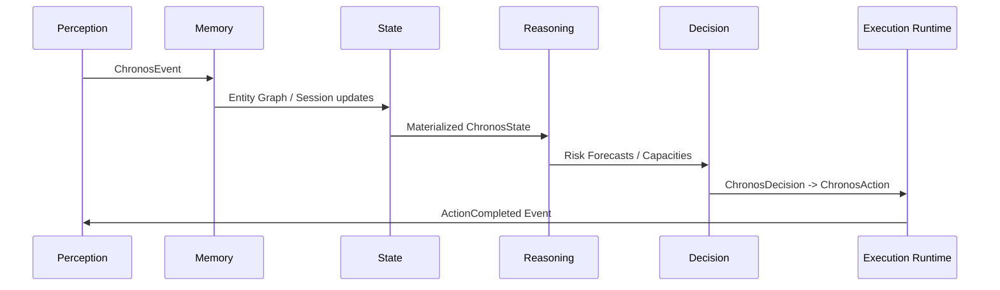

# Execution Runtime Specification

The Execution Runtime (Layer 5 Runtime) is the final layer of the PCOS architecture. It is responsible for physically executing `ChronosAction` requests (such as restoring workspaces, displaying desktop notifications, or saving recovery plans), and publishing execution events to complete the loop.

---

## 1. Specification

### Consumes
*   `ChronosAction` events.

### Produces
*   `ActionStarted`: Published when an action is dispatched to its specific executor.
*   `ActionCompleted`: Published when execution succeeds.
*   `ActionFailed`: Published when execution encounters an error.

### Service Integrations
*   `EventBus`: For publishing and subscribing to actions and execution statuses.
*   `ServiceRegistry` / `ServiceContainer`: Registers execution capabilities so other modules can invoke them.

---

## 2. Executor Components

### 2.1 WorkspaceRestorationExecutor
*   *Task:* Reopens target file lists and directories, re-establishing project continuity.
*   *Output:* Publishes `ActionCompleted` or `ActionFailed`.

### 2.2 RecoveryPlanExecutor
*   *Task:* Materializes recovery plan trajectories. Writes files or updates databases tracking recovery goals.

### 2.3 NotificationExecutor
*   *Task:* Issues desktop alerts or internal intervention banners.

---

## 3. End-to-End Cycle (Success Criteria)

---

## 4. Replay safety
*   To preserve strict audit history, every execution outcome (success or fail) publishes immutable `ChronosEvent`s detailing the `action_id`, status, and execution metadata. No mock data is used.
