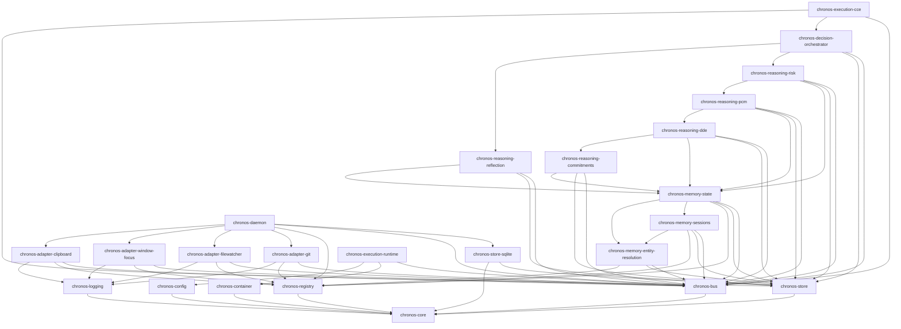

# CRATE_DEPENDENCY_GRAPH.md
*Authoritative Workspace Crate Dependency Specification & Verification*

---

## 1. Crate Dependency Graph

The modular PCOS framework consists of 24 core crates. The dependency relationships between layers are strictly managed:

---

## 2. Crate Inventory & Layer Mappings

### 2.1 Layer 0 — Infrastructure Crates
*   **`chronos-core`**: Core model schemas.
    *   *Direct Dependencies*: None.
    *   *Reverse Dependencies*: All workspace crates.
*   **`chronos-bus`**: Asynchronous EventBus.
    *   *Direct Dependencies*: `chronos-core`, `tokio`, `async-trait`.
    *   *Reverse Dependencies*: All Perception, Memory, and Execution runtime components.
*   **`chronos-store-sqlite`**: Durable event store.
    *   *Direct Dependencies*: `chronos-core`, `chronos-store`, `rusqlite`, `serde_json`, `uuid`.
    *   *Reverse Dependencies*: `chronos-daemon`, `chronos-api-bridge`.

### 2.2 Layer 1 — Perception Crates
*   **`chronos-adapter-clipboard`**: Clipboard listener.
    *   *Direct Dependencies*: `chronos-core`, `chronos-bus`, `chronos-registry`, `chronos-logging`, `windows-sys`.
    *   *Reverse Dependencies*: `chronos-daemon`.
*   **`chronos-adapter-window-focus`**: Window switch observer.
    *   *Direct Dependencies*: `chronos-core`, `chronos-bus`, `chronos-registry`, `chronos-logging`, `windows-sys`.
    *   *Reverse Dependencies*: `chronos-daemon`.

### 2.3 Layer 2 — Memory Crates
*   **`chronos-memory-sessions`**: Groups events into sessions.
    *   *Direct Dependencies*: `chronos-core`, `chronos-bus`, `chronos-store`, `chronos-memory-entity-resolution`.
    *   *Reverse Dependencies*: `chronos-memory-state`, `chronos-daemon`.

### 2.4 Layer 3 — Reasoning Crates
*   **`chronos-reasoning-risk`**: Formulates risk trends.
    *   *Direct Dependencies*: `chronos-core`, `chronos-bus`, `chronos-store`, `chronos-reasoning-pcm`.
    *   *Reverse Dependencies*: `chronos-decision-orchestrator`, `chronos-daemon`.

---

## 3. Coupling Violations & Debt Audit

*   **Linear Reasoning Coupling (Heuristic Layer dependency)**:
    *   *Status*: `chronos-reasoning-risk` directly references `chronos-reasoning-pcm`, which references `chronos-reasoning-dde`.
    *   *Violation*: This creates a linear compile dependency chain in Layer 3. If a change is made to `DDE`, all downstream reasoning crates must recompile.
    *   *Suggested Fix*: Decouple reasoning engines by publishing results as events (`DeadlineDiscovered`, `CapacityProfileUpdated`) on the `MemoryEventBus`, allowing each engine to run independently.
*   **Missing Core Interface abstraction**:
    *   Perception adapters (`chronos-adapter-clipboard`) directly depend on `windows-sys` and concrete bus instances. This makes unit testing on non-Windows platforms difficult. The adapters should depend on abstract OS interface traits instead.

---
