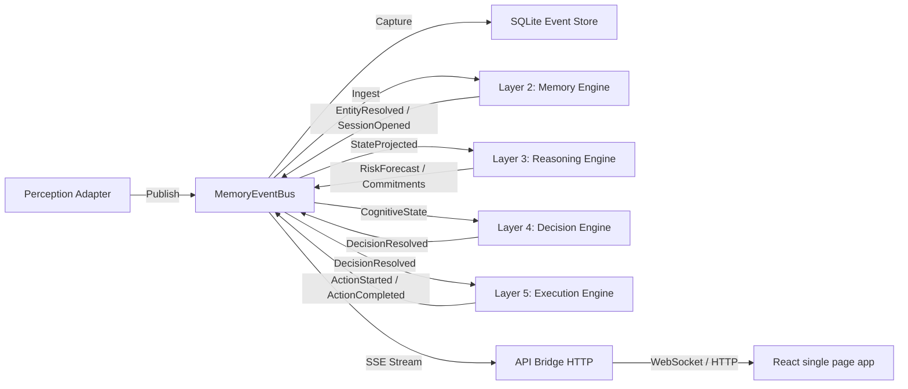

# EVENT_FLOW.md
*Authoritative Event Flow & Cognitive Processing Pipeline Specification*

---

## 1. The Global Event Pipeline

Every observation event captured by the host OS adapters follows a strict, unidirectional data pipeline:

---

## 2. Canonical PCOS Event Dictionary

The following table documents every event defined in the Chronos Object Model (COM), its producer, its consumers, its persistence behavior, and how it behaves during database replays:

| Event Type | Producer | Primary Consumers | Transformations Applied | Persistence | Replay Behavior |
| :--- | :--- | :--- | :--- | :--- | :--- |
| **`FileModified`** | `chronos-adapter-filewatcher` | `EntityResolver` | Correlated with local directory paths to resolve workspace entities. | Persisted in `chronos_events` | Replayed on startup to reconstruct entity graph. |
| **`GitCommitDetected`** | `chronos-adapter-git` | `EntityResolver`, `CommitmentEngine` | Translated to repository author mappings and branch updates. | Persisted in `chronos_events` | Replayed to rebuild project ownership states. |
| **`WindowFocusChanged`** | `chronos-adapter-window-focus` | `SessionEngine` | Parsed to track focus durations and determine activity shifts. | Persisted in `chronos_events` | Replayed to rebuild historical cognitive sessions. |
| **`ClipboardTextCopied`** | `chronos-adapter-clipboard` | `EntityResolver` | Analyzed for clipboard URL targets and document references. | Persisted in `chronos_events` | Replayed to reconstruct reference attachments. |
| **`EntityResolved`** | `chronos-memory-entity-resolution` | `SessionEngine`, `StateProjector` | Appends entities (with confidence scores) to the memory graph. | Persisted in `chronos_events` | Replayed during warming to accelerate entity lookups. |
| **`SessionOpened`** | `chronos-memory-sessions` | `StateProjector` | Marks the initiation of a user activity focus block. | Persisted in `chronos_events` | Replayed to restore timeline continuity boundaries. |
| **`StateProjected`** | `chronos-memory-state` | All Layer 3 Engines | Synthesizes current world snapshot as input for reasoning. | Persisted in `chronos_events` | Replayed to warm up reasoning models. |
| **`CommitmentResolved`** | `chronos-reasoning-commitments` | `DecisionOrchestrator` | Infers active obligations with deadline bounds. | Persisted in `chronos_events` | Replayed to reconstruct open task logs. |
| **`RiskForecastResolved`** | `chronos-reasoning-risk` | `DecisionOrchestrator` | Determines project failure levels and decay metrics. | Persisted in `chronos_events` | **Skipped** during replay to prevent loopback alerts. |
| **`DecisionResolved`** | `chronos-decision-orchestrator` | `ContextContinuationEngine` | Arbitrates intervention urgency and creates workspace plan requests. | Persisted in `chronos_events` | **Skipped** during replay to avoid duplicate notifications. |
| **`ActionStarted`** | `chronos-execution-runtime` | `MemoryEventBus`, React UI | Dispatches active workspace file tab restorations. | Persisted in `chronos_events` | **Skipped** during replay to avoid OS window manipulation. |

---

## 3. Replay Heuristics & Loop Feedback Prevention

To prevent infinite event loops (e.g., a replayed `DecisionResolved` event triggering a new `ActionStarted` event, which in turn writes to the database), the replay system enforces the following rules inside `chronos-daemon`:
*   **System Action Events** (`DecisionResolved`, `ActionStarted`, `ActionCompleted`, `ActionFailed`, `ContinuationPlanResolved`) are recorded for audit logs but are **explicitly ignored** when rebuilding state models (*Evidence: `chronos-daemon/src/main.rs#L354`*).
*   **Warming Boundary**: Memory warming only processes structural observation events (`FileModified`, `GitCommitDetected`, `WindowFocusChanged`, `ClipboardChanged`) to assemble in-memory entities and session timelines.

---
