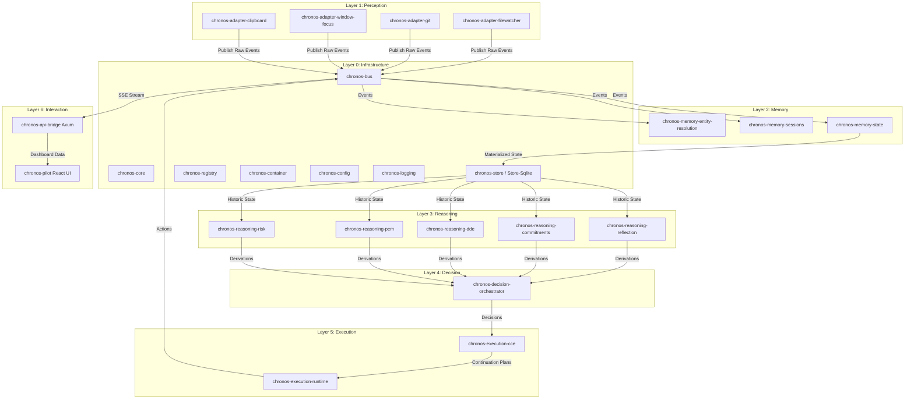

# MASTER_ARCHITECTURE.md
*Authoritative Master Architecture Specification — Ground Truth Reconstruction*

---

## 1. Overview & System Purpose

Chronos is a **Personal Context Operating System (PCOS)** designed to preserve human cognitive continuity. It acts as an observer-agent that monitors a user's local computing environment (files, directories, active focus windows, clipboards, editor states), builds an internal cognitive model of commitments and deadlines, and executes context-restoration actions when disruptions occur.

The system is structured as a **7-Layer Cognitive Architecture** and is undergoing migration from a legacy Tauri-based monolith into a modular, event-driven runtime governed by a deterministic, phase-based execution loop.

---

## 2. The 7-Layer PCOS Layout

The workspace is organized into seven conceptual layers. Each layer has specific architectural responsibilities, and data flows upward (from raw observation to memory structure) and downward (from reasoning to execution actions).



---

## 3. Subsystem Responsibilities & Ownership Boundaries

### 3.1 Layer 0 — Infrastructure (Kernel)
Provides the base execution primitives, dependency injection mechanisms, configuration providers, and event buses.
*   **`chronos-core`**: Defines the single source of truth for the Chronos Object Model (COM) schemas, such as events, states, decisions, actions, and reflections.
*   **`chronos-bus`**: Implements the asynchronous in-memory broker, utilizing a `tokio::sync::broadcast` channel to route events to subscribers.
*   **`chronos-store-sqlite`**: Handles SQLite serialization of event history. It stores raw JSON payloads inside the `chronos_events` table and anomalies in `chronos_alerts`.
*   **`chronos-registry`**: Maintains a thread-safe registry of active PCOS engines, their types, version numbers, and operational statuses.
*   **`chronos-container`**: A lightweight IoC dependency injection container allowing components to resolve shared singleton services at runtime.

### 3.2 Layer 1 — Perception (Adapters)
Monitors the host OS environment, parses raw events, and dispatches them to the `MemoryEventBus`.
*   **Clipboard Observer**: Monitors copy events, debounces duplicate payloads, extracts URL metadata, and publishes `ClipboardTextCopied` / `ClipboardUriCopied` events.
*   **Window Focus Observer**: Hooks into Win32 APIs (`GetForegroundWindow`) to audit process switches and publishes `WindowFocusChanged` events.
*   **Git Observer**: Polls designated local git repositories every 10 seconds, parses log files, and publishes `GitCommitDetected` events.
*   **File Watcher**: Listens for filesystem additions and changes in directories specified by `CHRONOS_WATCH_DIR`, emitting `FileCreated` and `FileModified` events.

### 3.3 Layer 2 — Memory
Aggregates and contextualizes perception streams.
*   **`entity-resolution`**: Identifies raw event attributes (e.g., file paths, URLs) and correlates them to persistent entities (e.g., files, projects, repositories) in a semantic graph.
*   **`sessions`**: Implements a time-decay algorithm (15-minute inactivity threshold) to group timeline streams into distinct, continuous session blocks.
*   **`state`**: Materializes the current `ChronosState` by tracking entity freshness, active focus sessions, and current provenance references.

### 3.4 Layer 3 — Reasoning
Applies heuristics and models over the materialized `ChronosState` to infer implicit rules and metrics.
*   **`commitments`**: Identifies obligations based on file references and git history.
*   **`deadline-discovery`**: Extracts explicit and implicit deadlines from dates using regex patterns.
*   **`capacity-model`**: Estimates focus stability, session velocity, and burnout risk.
*   **`risk-forecaster`**: Calculates the failure probability of active commitments using logistic decay curves.
*   **`reflection`**: Synthesizes natural language explanations detailing stalled projects and context drifts.

### 3.5 Layer 4 & 5 — Decision & Execution
Coordinates actions when risks cross intervention thresholds.
*   **`decision-orchestrator`**: Evaluates intervention urgency, calculates silence-vs-interruption costs, and issues unified `ChronosDecision` payloads.
*   **`execution-cce`**: Converts decisions into continuation plans and step-by-step checklists.
*   **`execution-runtime`**: Dispatches system actions, including visual desktop notifications and local tab/workspace restores.

---

## 4. Startup Sequence & Thread Ownership

Chronos operates two distinct execution topologies: the **Modular Daemon Runtime** (modern) and the **Tauri Desktop Shell** (legacy).

```
[Modular Daemon Process (chronos-daemon.exe)]
 ├── Main Thread (main.rs)
 │    ├── Init Logger & Configuration
 │    ├── Open chronos_events.db (SQLite Store)
 │    ├── Initialize MemoryEventBus (capacity: 4096)
 │    ├── Warm up State (Replay event history)
 │    └── Spawn Background Workers
 │
 ├── Thread Pool (Tokio Runtime)
 │    ├── API Bridge Web Server (Axum, Port 7899)
 │    ├── Pipeline Runner (Ingestion -> Memory -> Reasoning -> Decision -> Execution)
 │    ├── Window Focus Poller Loop (windows-sys)
 │    ├── Clipboard Hook Hook Loop (windows-sys)
 │    └── Git Directory Poller Loop (10-second ticker)
```

### 4.1 Storage Ownership
*   **`chronos_events.db`**: Owned entirely by `chronos-store-sqlite` inside `chronos-daemon`. Shared state queries are served over port 7899.
*   **`chronos.db` & `chronos_telemetry.db`**: Created and managed by the legacy Tauri monolith. Maintained for compatibility with the legacy Python worker.

---

## 5. Legacy Monolith vs. PCOS Modular Architecture

| Architectural Dimension | Legacy Monolith (`src-tauri`) | Modern PCOS Daemon (`chronos-daemon`) |
| :--- | :--- | :--- |
| **Routing & API Server** | Internal Axum server inside `server.rs` | Independent Axum server inside `chronos-api-bridge` |
| **Logic Orchestration** | Rigid, synchronous procedural code | Asynchronous event loop (`MemoryEventBus`) |
| **Data Loop** | Directly queries SQL database tables | Reconstructs state from stream events (Event Sourcing) |
| **Sidecars** | Launches Python processes directly | Standardized as Layer 1/Interaction clients |
| **State Storage** | Relational relational tables | Event-sourced ledger (`chronos_events`) |

---
