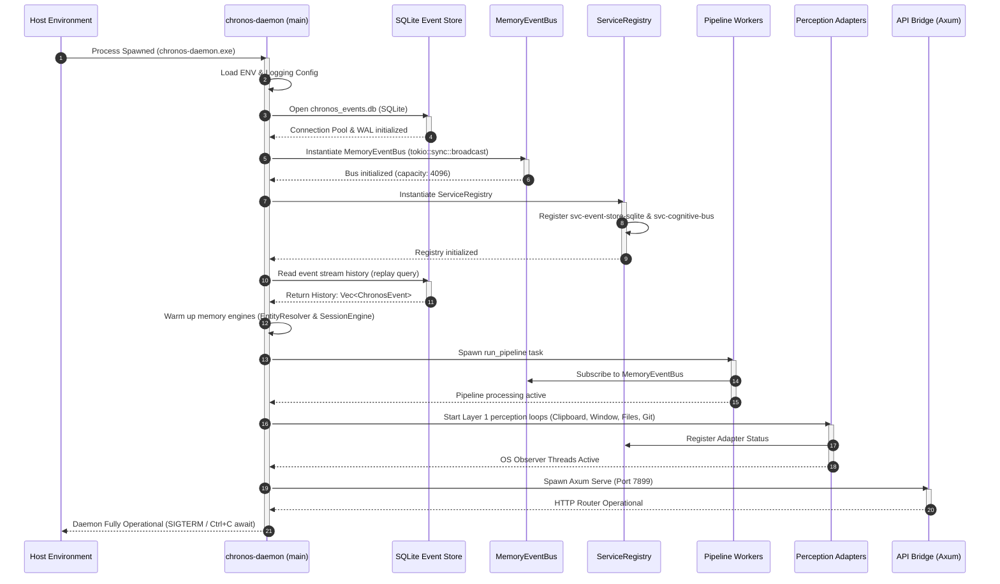
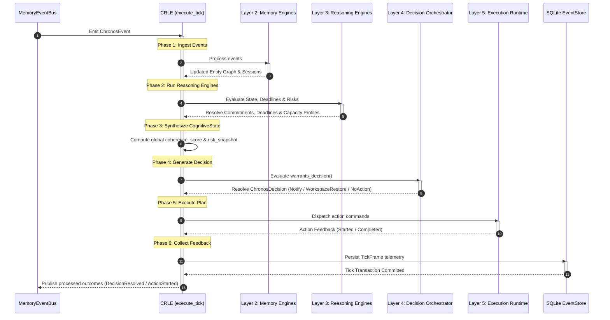

# RUNTIME_SEQUENCE.md
*Authoritative System Startup & Runtime Lifecycle Sequence Specification*

---

## 1. Subsystem Boot Order

The system follows a strict order when initializing components:

---

## 2. Service Registration & Dependency Injection

PCOS uses an IoC Container (`chronos-container`) to register and resolve singletons.
1.  **Registry Binding**: Every engine (e.g., `svc-commitment-engine`, `svc-decision-orchestrator`) registers its `ServiceDescriptor` with `ServiceRegistry` at boot.
2.  **Singleton Resolution**: Downstream processing loops retrieve dependencies by querying `Container::get::<T>()`.

---

## 3. The 6-Phase Cognitive Tick Loop

The processing pipeline is governed by a synchronous, transactional loop inside `chronos-runtime-loop` (Continuous Runtime Loop Engine):

---

## 4. Graceful Shutdown Order

Upon receiving `SIGINT` (Ctrl+C) or `SIGTERM`:
1.  **Adapter Termination**: Perception adapters exit Win32 hooks and file-watching threads.
2.  **Pipeline Flush**: The run_pipeline thread processes remaining events in the `MemoryEventBus` queue.
3.  **Database Commit**: Event serialization is flushed, transaction locks are released, and the connection pool closes.
4.  **Process Exit**: Clean exit code (0) is returned to the host OS.

---
