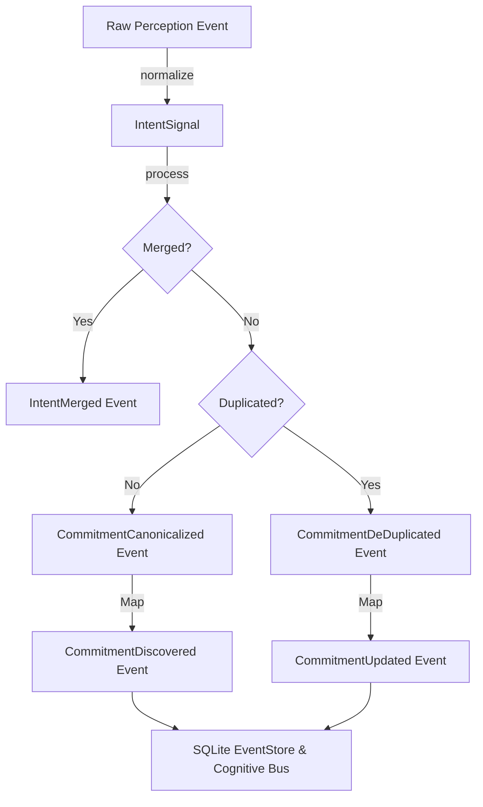

# Chronos Event Processing Orchestrator (CEPO)

CEPO unifies the runtime event flow between Reality Ingestion, Intent Canonicalization, and the Commitment Domain systems into a single deterministic, replay-safe execution pipeline.

## Pipeline Architecture

## Guarantees & Invariants
- **Deterministic Pipeline Execution**: The orchestrator is the single entry point for event flows. Input sequences produce identical derived outputs.
- **Replay Determinism**: The `rebuild_from_history` function uses the state reducer logic (`apply_event`) directly without regenerating derived events to guarantee idempotency and identical reconstructed state on start-up warmups.
