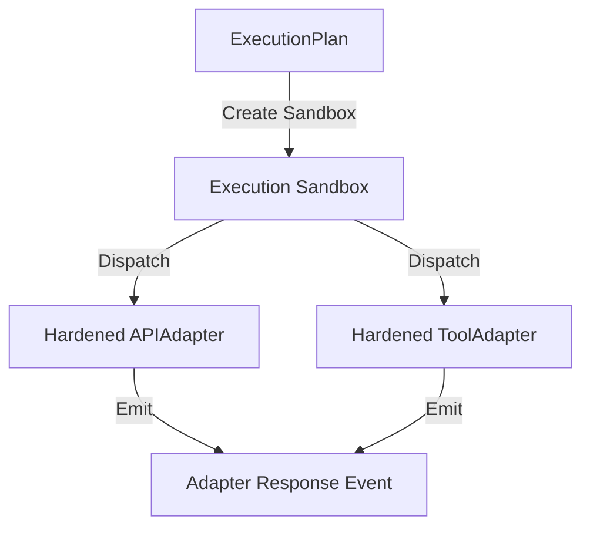

# Execution Adapter Hardening Layer (EAHL)

EAHL isolates and hardens real-world interactions (APIs, tools, file I/O) to prevent non-deterministic failures, enforce timeouts, schedule retries via events, and ensure replay safety.

## Sandbox and Dispatch Model

## Failure Taxonomy
- **NetworkTimeout**: Timeout constraint exceeded.
- **ConnectionFailure**: Underling connection handshake dropped.
- **InvalidResponse**: Payload failed target structural validations.
- **ExecutionRejected**: Sandbox configuration or authorization denied.
- **PartialExecution**: Task terminated mid-step.

## Replay Guarantees
Replay execution enforces dry-runs where all side-effects are completely disabled, deterministically reconstructing execution responses from historical event logs.
