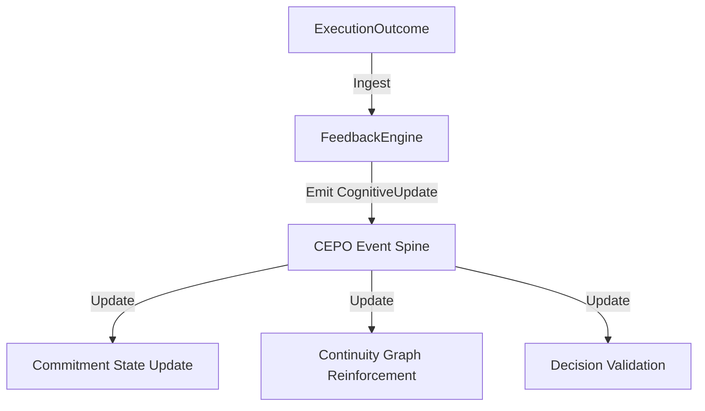

# Execution Feedback Integration Layer (EFIL)

EFIL closes the Chronos cognitive loop by ingesting Execution Outcomes and transforming them into deterministic updates across Intent, Commitment, Continuity, Coherence, and Decision subsystems via CEPO.

## Feedback Loop Architecture

## Cognitive Update Rules
- **Success**: Reinforces active intents (+0.2), marks commitments Completed, and validates decision ranking.
- **Failure / Partial Success**: Weakens intents (-0.3), marks commitments AtRisk, and invalidates decision ranking.

## Replay Guarantees
All feedback actions flow as immutable events in the CEPO stream, guaranteeing that replay generates identical graph adjustments across restarts.
