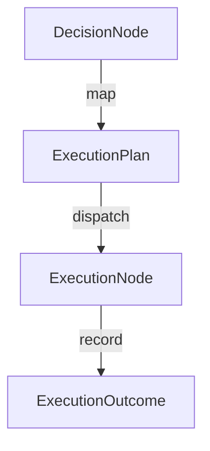

# Execution Orchestration Layer (EOL)

EOL converts deterministic DecisionNodes into validated, replay-safe, event-sourced real-world action executions, closing the loop between cognition and external system interaction.

## Execution Plan & Replay Graph

## Adapter Architecture
All interaction with the real world goes through adapters:
- **APIAdapter**: HTTP API actions.
- **ToolAdapter**: Local scripts and commands.
- **FileSystemAdapter**: IO file operations.
- **InternalTaskAdapter**: In-memory Chronos adjustments.

## Replay Guarantees
Execution outcomes are fully logged as immutable events. When performing historical replay, EOL reconstructs target outcome properties deterministically from logs, bypassing the physical execution phase.
