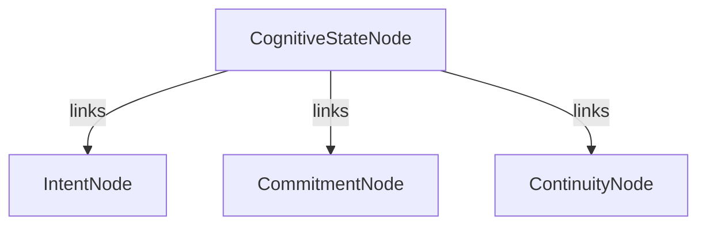

# Cognitive Coherence Engine (CCE-2)

CCE-2 unifies Intent Canonicalization, Commitment Domain, and Context Continuity Engine into a single globally consistent cognitive state model, resolving cross-layer contradictions and ensuring Chronos maintains a single coherent truth representation.

## Global Cognitive Graph Specification

## Conflict Taxonomy

1. **Intent–Commitment Mismatch**: An intent signal exists in the system, but no corresponding commitment has been registered or associated.
2. **Commitment–Continuity Drift**: Active commitments are inconsistent or drift in context across sessions.
3. **Intent–Continuity Divergence**: Persistent session intent contradicts active live intent nodes.

## Resolution Semantics
- **Merge**: Merges conflicting nodes into a single cohesive cognitive state.
- **Split**: Segregates conflicting semantic branches into separate entities.
- **Calibrate**: Dynamic adjustments of confidence weights and scores based on historical reinforcement context.

## Replay Guarantees
All coherence outcomes are fully event-sourced. The `rebuild_cognitive_state` reconstructs the entire state graph deterministically from the events logs without external side-effects.
