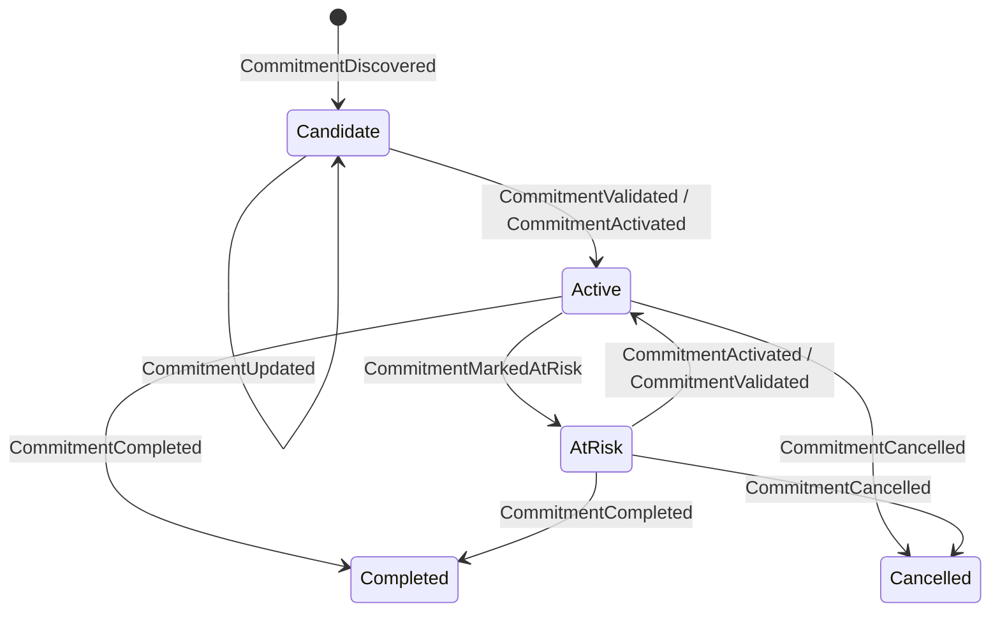

# Chronos Commitment Domain Model & Event Sourcing

This crate defines the canonical domain model, event types, state machines, and rebuild function for the Commitment Core Domain Layer.

## Lifecycle Status transitions

Commitments are strictly event-sourced and transition through the following lifecycle states:

- **Candidate**: Detected by inference (e.g. from telemetry and state projections).
- **Active**: Validated or activated manually or through explicit validation rules.
- **AtRisk**: Identified as having high risk or likelihood of delay/failure.
- **Completed**: Obligation fulfilled.
- **Cancelled**: Commitment abandoned or aborted.

## Event Schema Definitions

All events are defined in `src/lib.rs` and serializable/deserializable:

- **CommitmentDiscovered**: Extracted from external raw telemetry inputs, initializing a `Candidate` commitment.
- **CommitmentUpdated**: Changes properties such as title, content, or confidence.
- **CommitmentValidated**: Transforms a `Candidate` status to `Active`.
- **CommitmentActivated**: Transitions a `Candidate` or `AtRisk` commitment back to `Active`.
- **CommitmentMarkedAtRisk**: Flags an active commitment as having a potential delay.
- **CommitmentCompleted**: Closes out an active commitment as successfully resolved.
- **CommitmentCancelled**: Aborts a commitment obligation.
