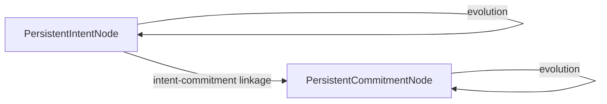

# Chronos Context Continuity Engine (CCE)

CCE provides cross-session temporal continuity for intents and commitments, ensuring Chronos maintains stable long-horizon understanding of user obligations, unresolved work, and evolving intent across time.

## Continuity State Graph

## Reinforcement & Decay Formulas

1. **Reinforcement**: Each recurring occurrence adds `+0.2` strength score.
2. **Decay**: Decay event payloads reduce the strength score. If `ReinforcementScore - DecayScore` falls below `0.2`, the status transitions to `Dormant`.
