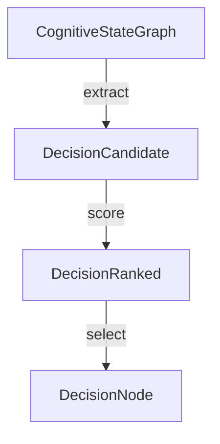

# Decision Orchestration Engine (DOE)

DOE converts the unified CognitiveStateGraph into deterministic, constraint-aware action selection, enabling Chronos to choose what to do next under competing commitments, priorities, and resource limits.

## Decision Theory Model & Decision Graph



## Scoring Formula Specification

```text
FinalScore = Urgency + Importance + TemporalWeight - Risk
```

- **Urgency**: Derived from conflict levels and deadline warnings.
- **Importance**: Set by commitment priorities.
- **TemporalWeight**: Driven by recency and context reinforcement.
- **Risk**: Penalty for drift or mismatch constraints.

## Determinism Guarantees
All actions are fully event-sourced. The tie-breaker logic sorts candidate actions by stable generated IDs to ensure absolute determinism under replay.
