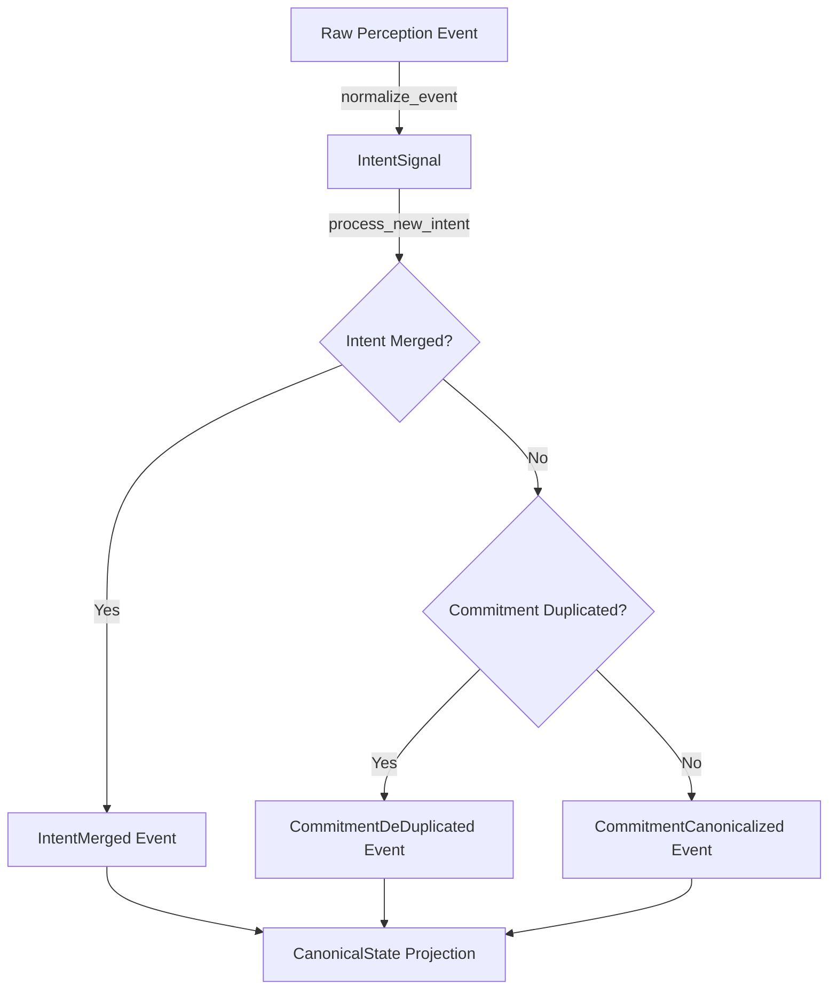

# Chronos Reasoning Intent Layer

This crate implements the Canonicalization + Intent Surface Extraction Layer, transforming raw reality signals and preliminary commitment events into stable, deduplicated, and semantically grounded canonical commitments within the Chronos event-sourced architecture.

## Intent → Commitment Pipeline

## Canonicalization & Deduplication Rules

1. **Intent Merging**:
   - Multiple raw `IntentSignal`s from the same source indicating similar/identical raw content within a 30-minute timeframe are merged into the target intent to strengthen confidence, rather than spawning new commitment threads.
2. **Commitment Deduplication**:
   - Extracted commitments are mapped to stable, deterministic IDs. Duplicate occurrences of identical commitments trigger deduplication actions (`CommitmentDeDuplicated`), appending them to `deduplication_trace` and combining their metadata and confidence scores.

## Replay Guarantees

All state transformations are derived strictly from ordered events. Using `rebuild_intent_and_commitment_state` guarantees exact state reconstruction and deterministic parity across restarts.
