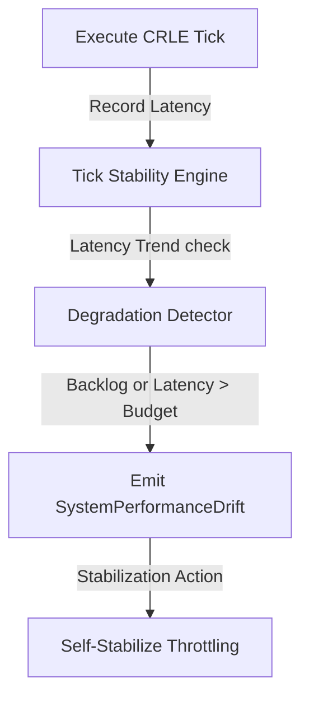

# Chronos CRLE Runtime Hardening & Load Stability Layer (CRLE-HLSL)

HLSL provides tick stability guards, memory cache constraints, backpressure throttling, and long-run degradation analysis to sustain continuous execution loops indefinitely without performance degradation.

## Stability Monitoring Model

## Runtime Invariants
- **Tick Budget**: Average tick duration must stay within maximum limit (e.g. 50ms).
- **Backpressure Capacity**: Action backlogs are capped; overflow inputs are queued or deferred.

## Self-Stabilization Strategy
1. **Pipeline Throttling**: Deferred low-priority ingestion.
2. **Cache Optimization**: Lazy recomputation of coherence maps.
3. **Event Compaction**: Pruning redundant intermediate outcomes.
