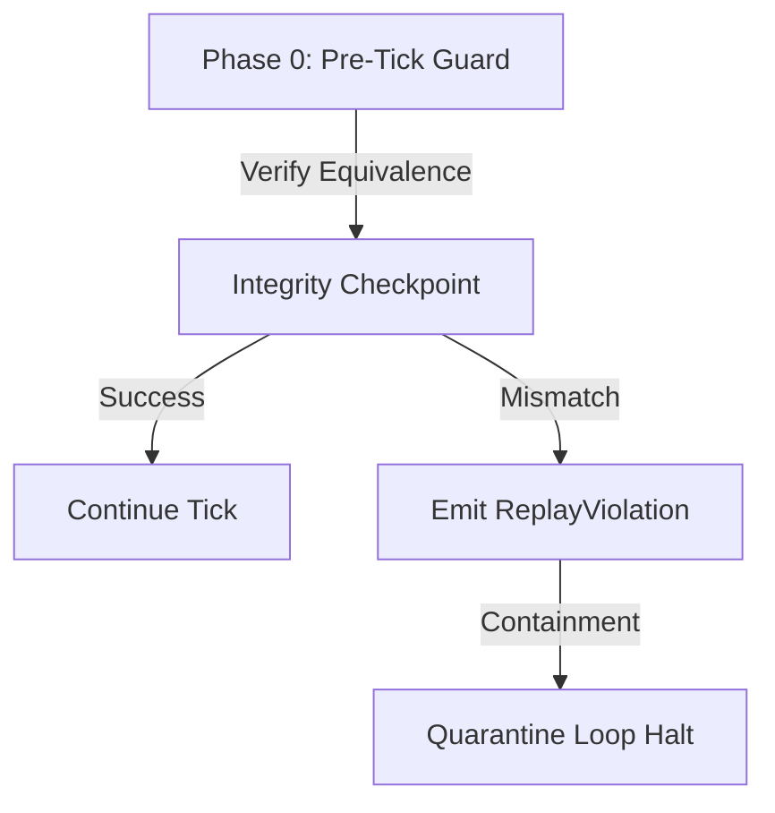

# Chronos System Integrity & Drift Detection Layer (CSIDDL)

CSIDDL guarantees long-term correctness, structural consistency, and cognitive coherence across all Chronos subsystems during continuous CRLE execution by detecting, isolating, and correcting systemic drift.

## System Invariants & Drift Checkpoints

## Drift Taxonomy
- **Intent Drift**: Divergence in normalized intent semantics.
- **Commitment Drift**: Discrepancies in target deadline metrics.
- **Continuity Drift**: Mismatches in memory reinforcement state graphs.
- **Decision Drift**: Ranking instability across identical cognitive states.
- **Execution Drift**: Outcomes diverging from raw adapter logs.

## Containment Strategy
1. **Soft Recalibration**: Project adjustments and memory weight recalibration.
2. **Subsystem Isolation**: Graph region freezing.
3. **Full Replay Rebuild**: State restoration from raw event store databases.
4. **Halt**: CRLE emergency loop freeze.
